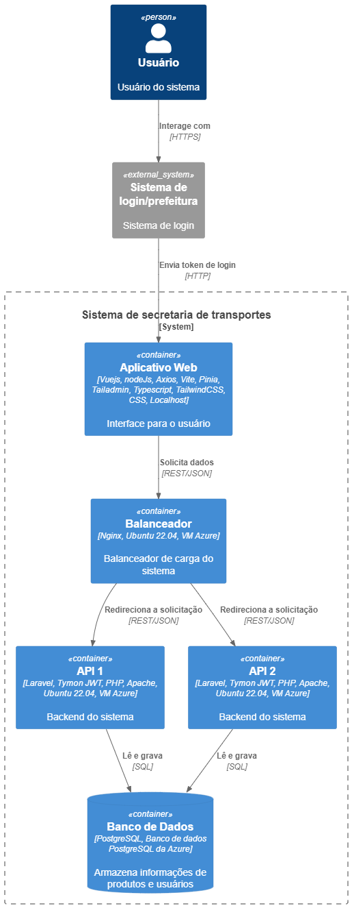

# Breve descrição

O usuário após efetuar o login na prefeitura e selecionado a secretaria de transportes para acessar, será redirecionado para o web app feito em Vuejs (que roda em cima do node), além do Vite que serve como starter pack, Pinia para gerenciamento de estado, Axios para requisições e TailwindCSS para estilização usando o Tailadmin como base para todo o projeto com a linguagem Typescript que foi disponibilizado para frontend. 

Esse frontend faz requisições para o balanceador de carga que usa o Nginx com o sistema operacional Ubuntu 22.04, o mesmo trata de organizar o trafégo para um dos dois servidores Backend.

Já nos servidores temos o Apache rodando o projeto feito em Laravel, com a biblioteca Tymon JWT que cuida da autenticação, a linguagem é PHP com o sistema operacional Ubuntu 22.04, onde se comunica com o banco de dados. Obs: Ambos os servidores são identicos, mudando apenas o IP/dominio dos mesmos.

O banco de dados em PostgreSQL fica responsável por todo o armazenamento.

Todo o projeto, com excessão do frontend, foi hospedado no Azure onde foram usadas as funcionalidades da plataforma para criar e rodar os 4 servidores.

